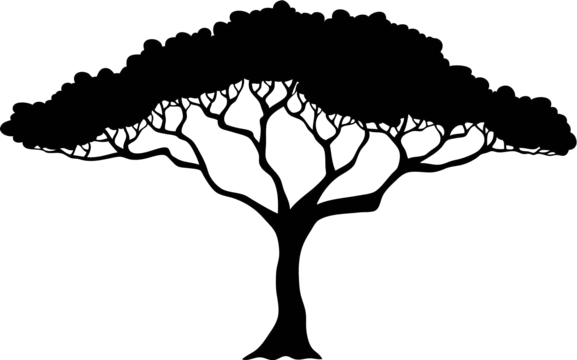

```{r}
#| label: setup
suppressPackageStartupMessages({
  library(here)
  library(data.table)
})
here::i_am("reports-src/slides.qmd")
source(here("R/utils/config.R"))
load_config()
invisible(list2env(
  readRDS(get_data_path("outputs", "summary_env")), environment()
))

# Formatting only: every number comes from summary_env.rds (03)
num.fn <- function(x) sub("^-", "−", sprintf("%.0f", x))
range.fn <- function(x) {
  paste(num.fn(x$lower), "to", num.fn(x$upper))
}
difference.fn <- function(s) differences[species == s]
est.fn <- function(s) paste(num.fn(difference.fn(s)$estimate), "g")
n.fn <- function(s) means[species == s, sum(n)]
largest <- differences[which.max(estimate), species]
spread <- paste(num.fn(min(differences$estimate)), "to",
                num.fn(max(differences$estimate)), "g")
dropped.v <- data$dropped_by_species[, sprintf("%d %s", N, species)]
ci_pct <- 100 * ci_level

# Claims the slides make, checked against the numbers
stopifnot(
  all(differences$lower > 0),
  model$male$lower > 0,
  model$chinstrap$lower < 0, model$chinstrap$upper > 0
)
```

## {.title-page}

::: {.title-block}
[Worked example · `r format(Sys.Date(), "%B %Y")`]{.eyebrow}

[Body mass of Palmer penguins by species and sex]{.title}

[A worked example of the R analysis project template]{.subtitle}

[Data: Gorman, Williams and Fraser (2014), `datasets::penguins`]{.byline}
:::

::: {.logos}
{.mcgill fig-alt="McGill University"}
{fig-alt="Douglas Research Centre"}
{fig-alt="StoP-AD Centre"}
:::

## How much heavier are males, and does it depend on the species? {data-eyebrow="Question and data"}

::: {.cards}
::: {.card .red}
**Penguins measured**

[`r data$penguins`]{.big} [penguins, three species]{.unit}

Palmer Archipelago, `r data$years[1]` to `r data$years[2]`
:::

::: {.card .red}
**Analysed**

[`r data$complete`]{.big} [with every measurement and a sex]{.unit}

Left out: `r paste(dropped.v, collapse = " and ")`
:::
:::

::: {.note}
**Data:** `datasets::penguins`, shipped with R since 4.5; Gorman, Williams
and Fraser (2014).
:::

## Males are heavier in every species {data-eyebrow="Results"}

```{r}
#| fig-align: center
#| fig-cap: !expr 'sprintf("%d penguins. Points: individual penguins. Black: means with %.0f%% confidence intervals.", data$complete, ci_pct)'
knitr::include_graphics(slide_figure)
```

## The difference is largest in `r largest` penguins {data-eyebrow="Results · Within species"}

::: {.cards}
::: {.card .adelie}
**Adelie**

[`r est.fn("Adelie")`]{.big} [`r n.fn("Adelie")` penguins]{.unit}

`r ci_pct`% CI `r range.fn(difference.fn("Adelie"))` g
:::

::: {.card .chinstrap}
**Chinstrap**

[`r est.fn("Chinstrap")`]{.big} [`r n.fn("Chinstrap")` penguins]{.unit}

`r ci_pct`% CI `r range.fn(difference.fn("Chinstrap"))` g
:::

::: {.card .gentoo}
**Gentoo**

[`r est.fn("Gentoo")`]{.big} [`r n.fn("Gentoo")` penguins]{.unit}

`r ci_pct`% CI `r range.fn(difference.fn("Gentoo"))` g
:::
:::

::: {.note}
**Male minus female** mean body mass within each species, with a Welch
confidence interval (CI).
:::

## Adjusted for species, males are heavier by `r num.fn(model$male$estimate)` g {data-eyebrow="Results · Model"}

| Comparison | Difference (g) | `r ci_pct`% CI (g) |
|---|---|---|
| Males vs females | `r num.fn(model$male$estimate)` | `r range.fn(model$male)` |
| Chinstrap vs Adelie | `r num.fn(model$chinstrap$estimate)` | `r range.fn(model$chinstrap)` |
| Gentoo vs Adelie | `r num.fn(model$gentoo$estimate)` | `r range.fn(model$gentoo)` |

[Linear model of body mass on species and sex; `r model$n` penguins;
R² `r sprintf("%.2f", model$r_squared)`. Chinstrap and Adelie penguins of
the same sex do not clearly differ.]{.small}

::: {.note}
**One difference for all species:** the model assumes it, while within
species the difference ranges from `r spread`.
:::
